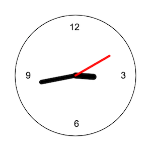

# Problem F

In this exercise, you will use callback functions to work with [timers](https://www.w3schools.com/js/js_timing.asp), producing an _animation_ with the HTML5 Canvas of a ticking clock:



To complete the exercise, edit the included **`js/index.js`** file to add in the code described in the comments. Note that you will _not_ need to edit the HTML file!

You can see the results of your work by opening up the included `index.html` file in a browser. Remember to refresh the page after you update your code, and to check for any errors in the Developer console.

## Testing
This exercise includes a test suite to verify that you have completed the exercise (though it does not check the accuracy of your work). Instead, it is up to you to decide how to draw a clock and to make sure you can produce the desired effect!

Nevertheless, you can run the test suite using

```bash
jest problemF
```
